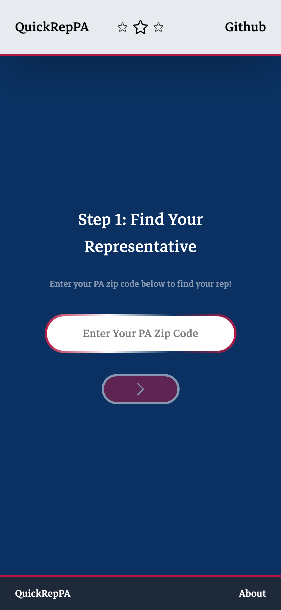

# QuickRepPA, get your PA rep's mailing address fast

QuickRepPA is a simple project designed to rapidly give users their representatives mailing address. Designed to be applicable to any state by swapping out the data, this current version is based in PA.
<br>
<br>
This project aims to remove all friction in this process and make finding the necessary information so easy anyone could quickly make their voice heard. Simply enter a zip code,
and recieve a mailing address.
<br>
<br>
This project can quickly be modified for any state by updating the reps.json with your state rep information. In main.jsx simply change the error message to your state and it will work right away!
The zip search will try and match a result in your reps.json, so if the zip doesn't exist in reps.json it will return as 'not valid xyz zip code'. 
<br>
<br>
Live Demo: [here!](https://quickrep-pa.pages.dev/)

## How it was made:

**Tech used:** 
- Framework: React
- Build Tool: Vite
- Styling: TailwindCSS, CSS
- State Management: Jotai
- Data: manual JSON created with assistance by ClaudeCode
- API: none
- Deployment: Cloudflare Pages
- Other: 
  - HeroIcons for star, X, and left/right chevron icons
  - Google Fonts for Markazi Text font
  - Framer Motion for animations
  - favicon io for US flag favicon

## Visual Examples
<br> Mobile Landing Page <br>



<br> Result Page <br>


## How To Run The Project

1. Download or clone the repo onto your local environment, and navigate into the folder
```
git clone https://github.com/cescosgames/quickrepPA
cd quickrepPA
```
2. Install dependencies
```
npm install
```
3. Run the dev server
```
npm run dev
```
4. Go to your selected local host in your browser (Vite default is 5173)
5. Navigate to the Main.jsx component file to add your representative API. Explanations are in the Main.jsx file
6. Note: The current version of this project uses an example JSON file in the public folder since Google Civic Information will no longer work

## Features:

This project features
1. Simple, and keyboard accessible layout
2. Straightforward delivery of necessary information
3. Modular and applicable to any state

## Notes and Background:

This project was born when I stopped by a 'write to your representative'
table run by a civic minded individual. They provided great assistance to lots of people who wanted to get started writing to their representatives but did not know how, 
myself included! The first step of course, was to find your representative and I noticed that the offical government website was not mobile friendly and provided lots of
information that might not be necessary for someone who is just quickly trying to get the correct mailing address to send their letters to.
<br><br>
At the moment, this project does not have a civic information API to rely on to gather relevant information. Google Civic Information seemed to be the best option, but 
since it is being discontinued I did not end up implementing it in this version. I will continue to look into other options from which to gather the necessary information.
<br><br>
Right now, this project is fairly modular and can be applied to any state (or even all the states) by finding an API that contains representative data. All you have to do is
switch every instance of PA with your state (or USA) and connect your API to the main fetch request in Main.jsx (line 22). I set up two examples 1. using the data.json in the
projects public folder and 2. using the Google Civic Information API endpoint. You will have to then tweak the result depending on the structure of the data you recieve back.
<br><br>
As a stretch goal, I would like to add template current issue letters that users could copy and paste or print directly from the result screen. The goal is to make the 
process as frictionless as possible to get peoples voices heard, so anything that can make the process easier I would like to explore.
<br><br>
Thanks for checking this project out, I'm always open to improvement so any advice, comments, or criticism is always welcome!
<br><br>
<br><br>
Update 2/17/26:
<br><br>
Thanks to assistance from Claude, I realized I didn't need a an API to call the zip -> rep data, I could generate it for myself in a way that is good enough for most users (not counting the overlapping districts). I used Claude Code to generate a comprehensive json file of all our state representatives with contact information and zip codes for quick lookup. In the case of overlapping zips, the first rep is returned.
<br><br>
Now that I have this functional, there is a lot of room for improvement like returning multiple reps for overlapping zips or adding direct clickable links to rep websites.

## TODO
- [ ] Pass rep data as structured props instead of a template literal string so the website can be rendered as a clickable `<a>` tag in JSX
- [ ] Replace `alert()` calls with inline error/feedback messages for better UX
- [ ] Add notification for overlapping zip rep districts